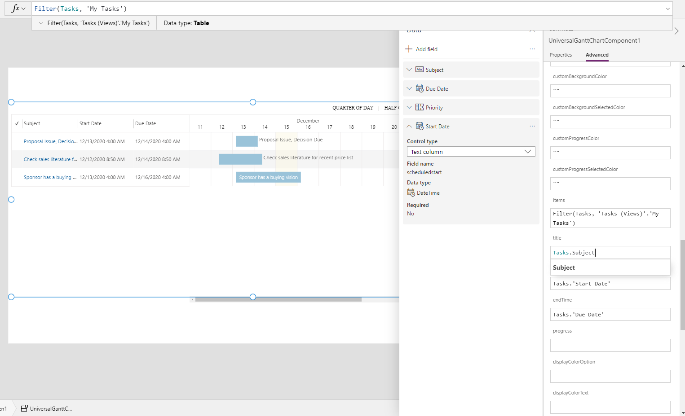
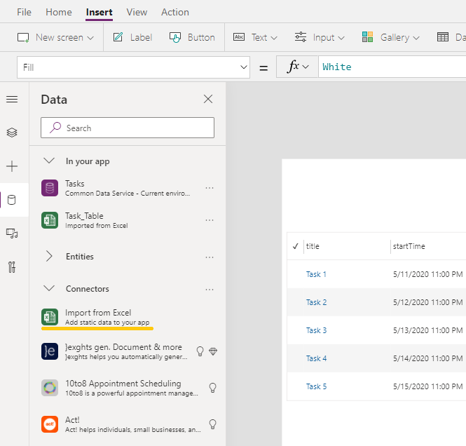
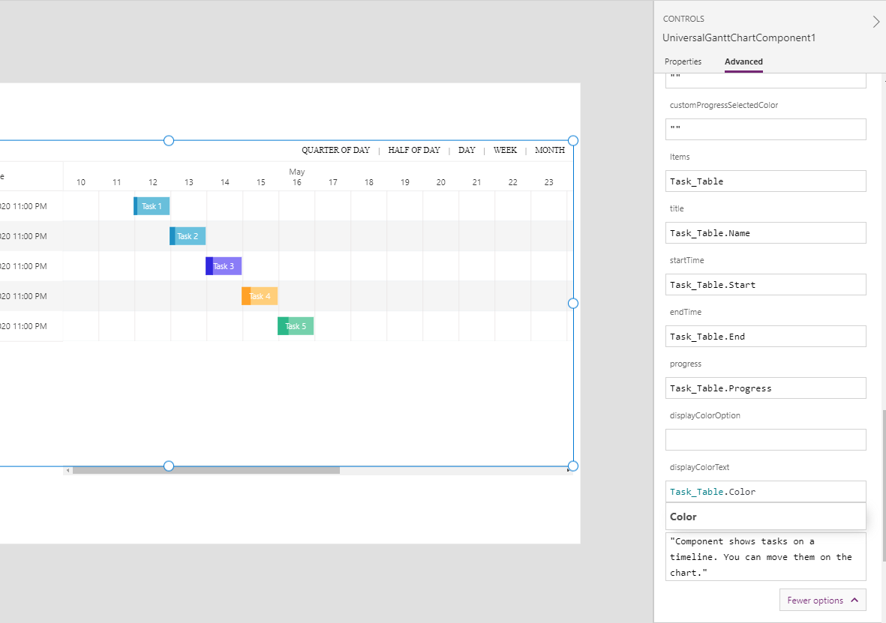
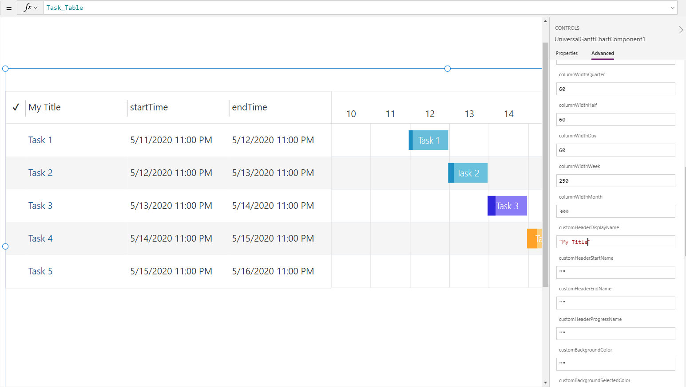

# Guide for canvas app

- [How to use gantt with Dynamics 365 data source](/Canvas%20Guide.md#how-to-use-gantt-with-dynamics-365-data-source)
- [How to use gantt with custom collection](/Canvas%20Guide.md#how-to-use-gantt-with-custom-collection)

## Configuration

| Parameter Name                                  | Name in canvas app designer   | Options                               |
| :---------------------------------------------- | :---------------------------- | :------------------------------------ |
| Title\*                                         | title                         |
| Start Time\*                                    | startTime                     |
| End Time\*                                      | endTime                       |
| Progress                                        | progress                      |
| Display Color(Option)                           | displayColorOption            |
| Display Color(Text)                             | displayColorText              |
| Display Mode\*                                  | displayMode                   | "editable", "readonly"\*\*            |
| IsSubgrid\*                                     | isSubgrid                     | "no", "yes"\*\*\*                     |
| Default Duration View\*                         | viewMode                      | "quarter","half","day","week","month" |
| Display Date Format\*                           | displayDateFormat             | "datetime", "date"                    |
| Time Step\*                                     | timeStep                      |
| Font Size\*                                     | fontSize                      |
| Header Height\*                                 | headerHeight                  |
| Row Height\*                                    | rowHeight                     |
| List`s Cell Width\*                             | listCellWidth                 |
| Column Width for Quarter of Day\*               | columnWidthQuarter            |
| Column Width for Column Width for Half of Day\* | columnWidthHalf               |
| Column Width for Column Width for Day\*         | columnWidthDay                |
| Column Width for Column Width for Week\*        | columnWidthWeek               |
| Column Width for Column Width for Month\*       | columnWidthMonth              |
| Custom Display Name                             | customHeaderDisplayName       |
| Custom Start Name                               | customHeaderStartName         |
| Custom End Name                                 | customHeaderEndName           |
| Custom Progress Name                            | customHeaderProgressName      |
| Custom Progress Color                           | customBackgroundColor         |
| Custom Progress Selected Color                  | customBackgroundSelectedColor |
| Custom Background Color                         | customProgressColor           |
| Custom Background Selected Color                | customProgressSelectedColor   |

\*Required

\*\* Works in "readonly" mode only

\*\*\* This params are for model driven only

## How to use gantt with Dynamics 365 data source

Please use [this guide](https://docs.microsoft.com/en-us/powerapps/developer/component-framework/component-framework-for-canvas-apps) before you have been started.

1. Go to the Properties tab. Select entity in Entity-Grid(Items) and View
2. Select necessary fields
   
3. Go to the Advanced tab
4. Change _displayMode_ to readonly
5. Setup _title_, _startTime_, _endTime_. Now this is working as Entity.EntityField
   

## How to use gantt with custom collection

Please use [this guide](https://docs.microsoft.com/en-us/powerapps/developer/component-framework/component-framework-for-canvas-apps) before you have been started.

In this example I use Excel data source. [Test file](./DocumentationAssets/TasksList.xlsx?raw=true)

1. Go to the Properties tab. Select data source or your custom collection in Entity-Grid(Items)
2. Go to the Advanced tab
3. Change _displayMode_ to readonly
4. Setup _title_, _startTime_, _endTime_ and other fields. Now this is working as Source.Field
   
5. Setup display fields naming. There are _customHeaderDisplayName_, _customHeaderStartName_, _customHeaderStartName_, _customHeaderEndName_, _customHeaderProgressName_
   
