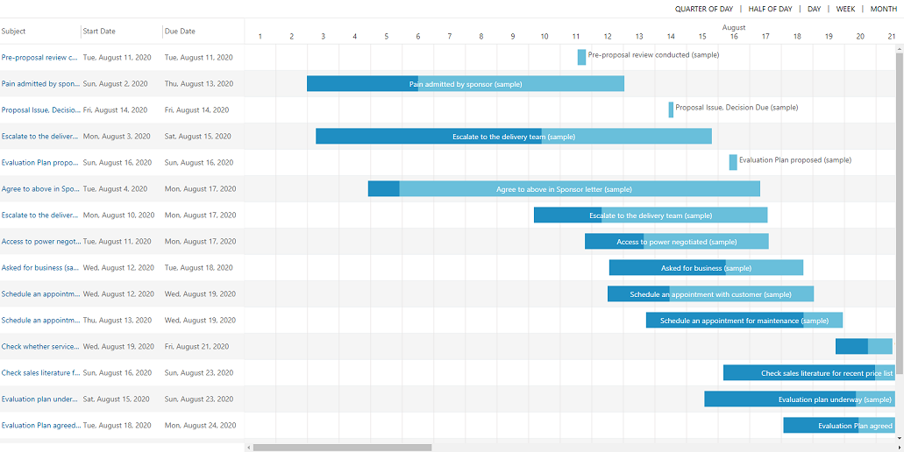
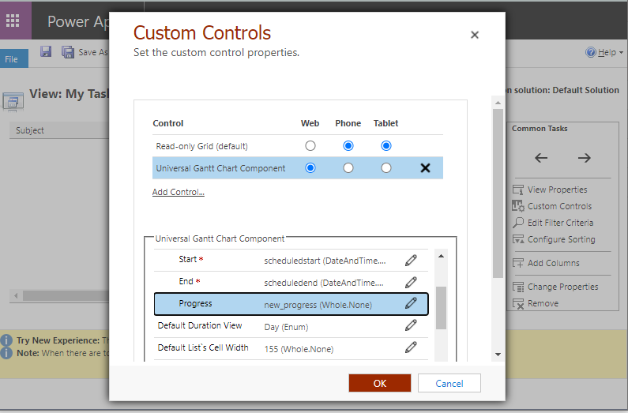

## Quick guide for model driven

1) Install the latest solution from [here](https://github.com/MaTeMaTuK/pcf-universal-gantt-chart/releases)
2) Prepare entity color for palette. Read more [here](./README.md)

